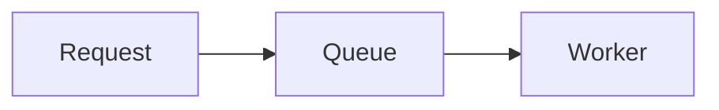
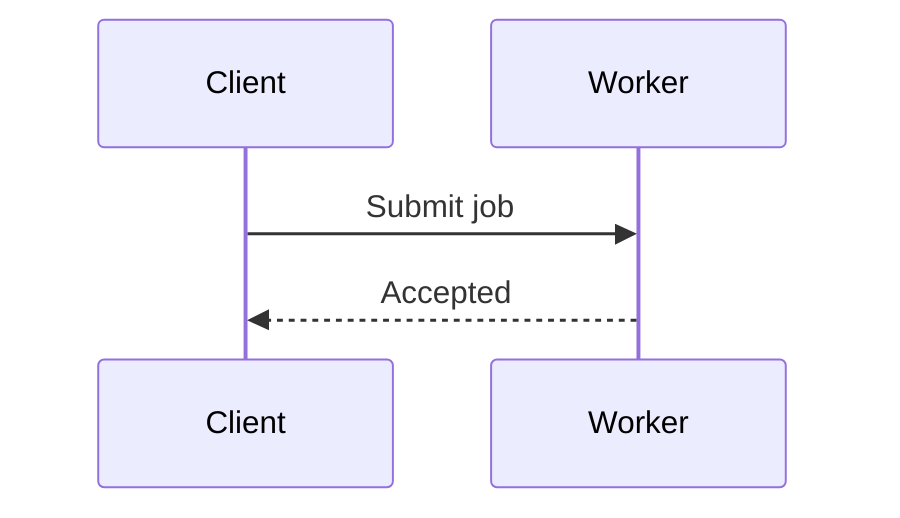
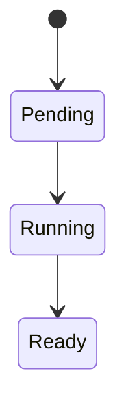
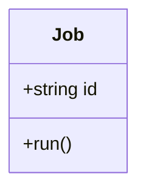
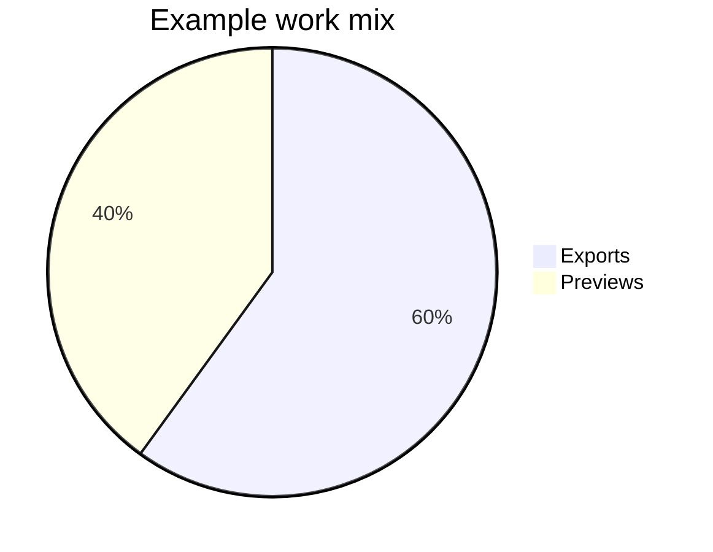
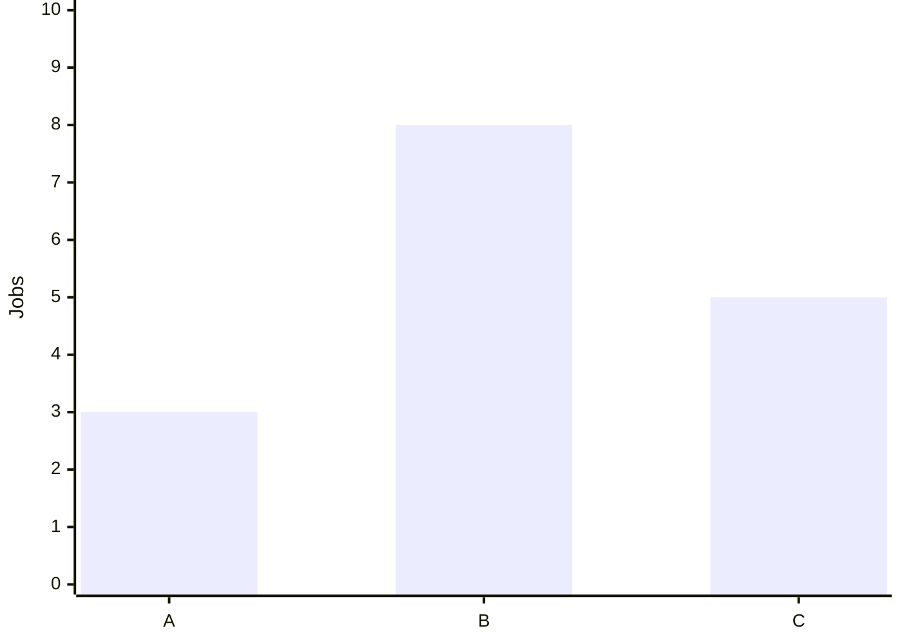
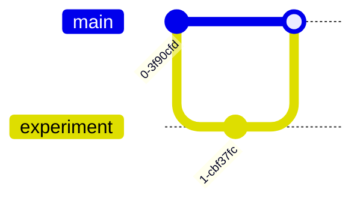

# Mermaid diagrams

Read when creating or changing a Mermaid visual. Use the bundled [diagram component](../assets/templates/diagram.html); put escaped Mermaid source inside `pre.mermaid` within `figure.diagram`, followed by a descriptive `figcaption`.

## Choose a form

Use a diagram to expose a relationship or sequence that prose alone obscures. Keep node labels short; explain qualifications in nearby text. Split crowded diagrams rather than shrinking the text.

These chart values are illustrative. Use supported syntax for the bundled version; consult [official Mermaid documentation](https://mermaid.js.org/intro/) for additional forms or syntax you have not verified.

## Shared theming and export

- [components.js](../assets/components.js) configures Mermaid from the active CSS tokens at render time and re-renders when the theme changes. Agents author the diagram, not a new palette.
- Keep colour settings and theme directives out of individual diagram definitions. Improve shared configuration when a diagram family needs additional tokens.
- Captions explain the visual's meaning. Markdown export retains the Mermaid source and caption; it does not preserve an interactive renderer.
- Use ASCII for a simpler text relationship, or themed custom SVG/canvas for visuals Mermaid cannot express well.

## Check and repair

- Check rendering and readability in both themes after introducing a new diagram form or changing shared rendering code. Routine diagrams need a quick visual/content check.
- If parsing fails, inspect the visible source fallback. Check diagram type, arrows, quoted labels and HTML escaping first; reduce to a small valid example before restoring complexity.
- If a visual is too wide, shorten labels, change direction or split the diagram. Preserve readable text on mobile.
- If colours clash, inspect shared theme variables rather than applying white backgrounds or inline colour patches to the page.
