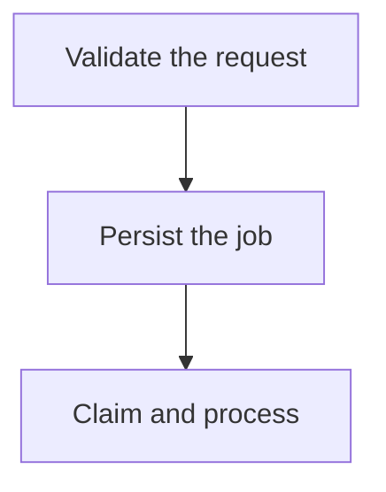
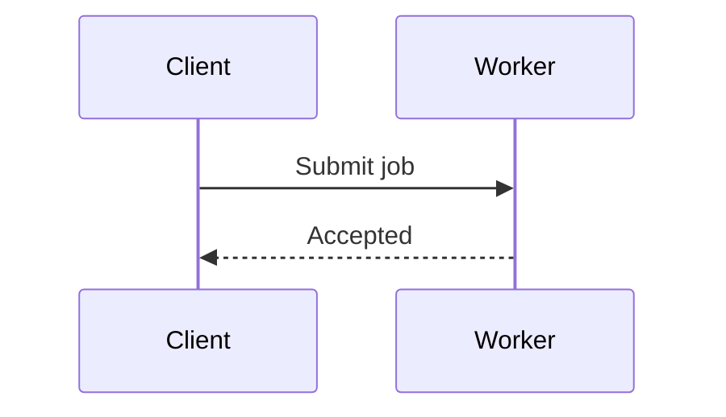
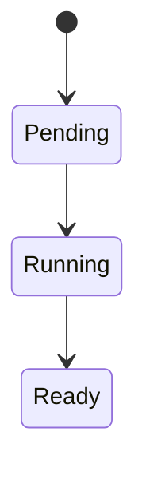
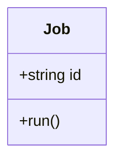
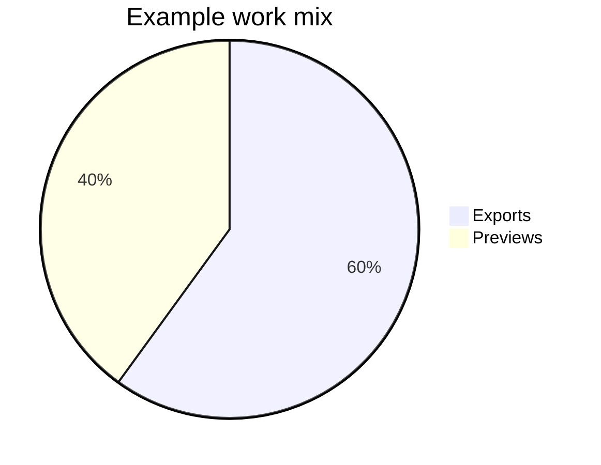
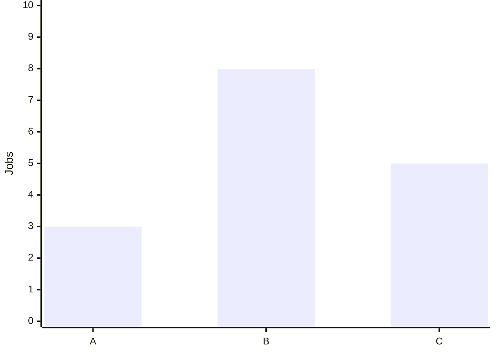
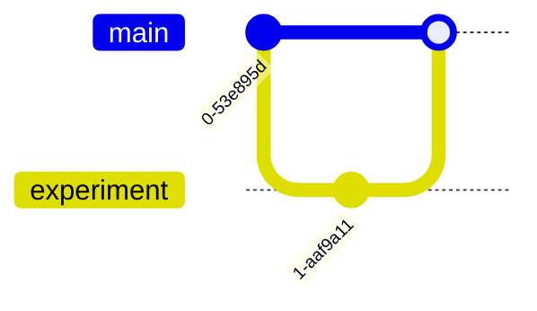

# Mermaid diagrams

Read when creating or changing a Mermaid visual. Use the bundled [diagram component](../assets/templates/diagram.html); put escaped Mermaid source inside `pre.mermaid` within `figure.diagram`, followed by a descriptive `figcaption`.

## Choose a form

Use a diagram to expose a relationship or sequence that prose alone obscures.

- Prefer `flowchart TD` or `TB` for multi-step pipelines. Use `LR` for short relationships, usually two or three compact stages, or when horizontal direction carries meaning. Mermaid does not wrap a chain onto a new row.
- Give each diagram one explanatory job. Split a large architecture into an overview and focused flows; use matching names and captions to connect them. A tall unreadable diagram also needs splitting.
- Keep labels to a short phrase. Use Markdown labels (`A["`Authorise the request`"]`) so the shared wrapping width can break them across lines. Put qualifications, long identifiers and implementation details in nearby prose or a table.
- Shorten edge labels as carefully as node labels. Branches, cross-links and subgraphs can make a vertical diagram wide too. Preserve relationships when changing layout; never reorder a process simply to fit it.
- Keep shared font sizing. The renderer preserves intrinsic dimensions and provides scrolling when necessary; scrolling is a fallback for a meaningful wide structure, not a substitute for composing a readable lesson.

These chart values are illustrative. Use supported syntax for the bundled version; consult [official Mermaid documentation](https://mermaid.js.org/intro/) for additional forms or syntax you have not verified.

## Shared theming and export

- [components.js](../assets/components.js) configures Mermaid from the active CSS tokens at render time and re-renders when the theme changes. Agents author the diagram, not a new palette.
- Keep colour settings and theme directives out of individual diagram definitions. Improve shared configuration when a diagram family needs additional tokens.
- The renderer keeps SVG text at its natural size rather than shrinking the whole diagram to the page. Wide diagrams get a focusable scroll region and a visible scroll hint; this also works on narrow screens. Markdown flowchart labels wrap using shared configuration.
- Captions explain the visual's meaning. Markdown export retains the Mermaid source and caption; it does not preserve an interactive renderer.
- Use ASCII for a simpler text relationship, or themed custom SVG/canvas for visuals Mermaid cannot express well.

## Check and repair

- Check rendering and readability in both themes after introducing a new diagram form or changing shared rendering code. Routine diagrams need a quick visual/content check.
- If parsing fails, inspect the visible source fallback. Check diagram type, arrows, quoted labels and HTML escaping first; reduce to a small valid example before restoring complexity.
- Inspect a new diagram at its actual reading width and a narrow viewport. Labels must be readable without browser zoom, remain inside their nodes, and have no overlaps or clipped arrowheads. For overflow, confirm the region scrolls with keyboard and touch while the page itself stays within the viewport.
- If a visual is too wide, shorten or wrap labels, change direction, or split the diagram. Check the result rather than assuming `TD` or a larger font fixes the layout. Keep the caption useful when only part of a wide diagram is visible.
- If colours clash, inspect shared theme variables rather than applying white backgrounds or inline colour patches to the page.
