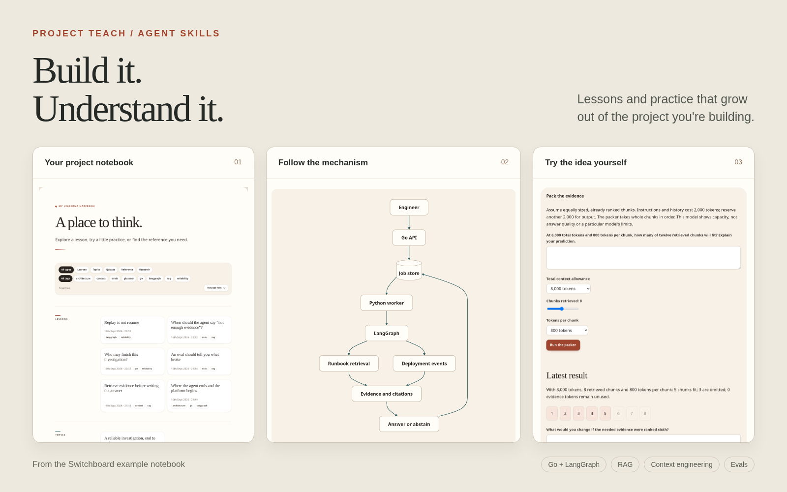
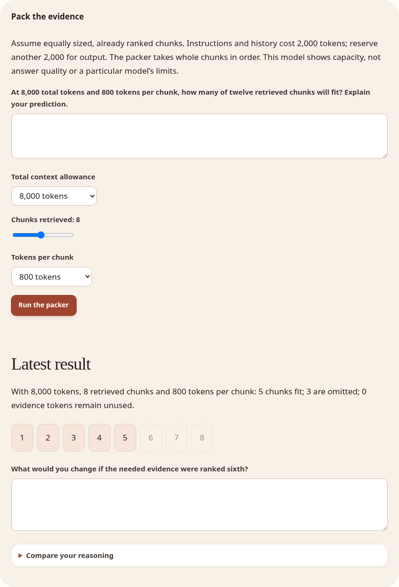

# Project Teach

Project Teach is a set of five skills that help your AI coding agent teach you through the project you're building. Ask about a design decision, work through an explanation using your code, and try a small exercise before returning to the implementation.

Lessons, practice and notes live in a browsable `.learning/` notebook inside your project. The agent records what has been introduced separately from what your reasoning has demonstrated, so a later session can pick up without treating a generated lesson as something you've mastered.

## Install and use

Run this from the project you want to learn in. It installs the teaching package from this repository's `skills/` folder:

```sh
npx skills@latest add bradypp/project-teach --skill '*'
```

Choose your coding agent when prompted. Install all five skills: they share references, templates and helpers. You need Node.js for the installer and Python 3 for the notebook helper. Generated pages open in a browser without a server.

Ask your agent for the skill by name, or use its skill picker. Start with the question in front of you; setup is optional.

| Skill | Example request |
| --- | --- |
| `teach` | “Use the teach skill. Our search finds the right runbook, but the answer ignores it. Explain how evidence gets from retrieval into the prompt, using this project's code.” |
| `teach-setup` | “Use the teach-setup skill. I'm building an incident agent with Go and LangGraph. I know HTTP APIs, but queues and graph recovery are new to me. Help me choose a learning goal.” |
| `teach-quiz` | “Use the teach-quiz skill. Give me a trace where a useful source disappears before generation. Let me locate the failure before showing the explanation.” |
| `teach-review` | “Use the teach-review skill. I'm about to add worker retries. Help me check what I understand about leases and what I should revisit first.” |
| `teach-update` | “Use the teach-update skill. I traced the duplicate investigation to a retry after a lost response. Two tenants can use the same request key, so I think the lookup needs both tenant and key. Check my reasoning against the code and update my notes.” |

Setup can also enable teaching during ordinary development. It stays off until you choose it; you can always ask for a lesson directly.

If you have a checkout and prefer to copy the package yourself, run this from the repository root:

```sh
python3 scripts/install.py /path/to/your-project/.agents/skills
```

Use your agent's skill directory as the destination. This installer refuses to overwrite existing skills.

## What it teaches

The subject comes from your work, not a fixed course. A retry bug can lead to a lesson on idempotency. A slow query can become a worked example of indexing. The agent supplies prerequisites, explains the mechanism and asks you to apply it to the decision you need to make.

Substantial explanations become HTML lessons with code, diagrams and links to related topics. Practice can ask you to predict a result, debug a scenario or change inputs in an experiment. You can discuss your answer in chat, ask for a deeper explanation, or keep building without finishing the exercise.

The notebook keeps useful explanations close to the code. Topic pages connect related lessons; a short learning-state summary and selective evidence records help the agent distinguish exposure from understanding.

## Explore an example

The [Switchboard notebook](https://bradypp.github.io/project-teach/) follows a fictional incident-investigation agent.

[](https://bradypp.github.io/project-teach/)

| Open an example | Try this |
| --- | --- |
| [Where the agent ends and the platform begins](https://bradypp.github.io/project-teach/lessons/agent-runtime.html) | Follow a request into a durable job. Decide what happens when a worker finishes after losing its lease. |
| [Context lab](https://bradypp.github.io/project-teach/quizzes/context-lab.html) | Retrieve more chunks without increasing the token budget. Predict which evidence still fits. |
| [Incident room](https://bradypp.github.io/project-teach/quizzes/incident-room.html) | Find where the trace lost the useful evidence, then compare your diagnosis with the feedback. |
| [An eval should tell you what broke](https://bradypp.github.io/project-teach/lessons/evals-that-find-the-failure.html) | Separate retrieval, packing and answer failures before changing the prompt. |
| [Replay is not resume](https://bradypp.github.io/project-teach/lessons/replay-is-not-resume.html) | Work out why repeating a read-only tool call can change an investigation's answer. |

[](https://bradypp.github.io/project-teach/quizzes/context-lab.html)

Switchboard is a teaching example, not a running backend. Its traces and evaluation counts are synthetic, and it makes no claims about a learner's achievements. The initial lessons explain design mechanisms; later recovery lessons link to framework documentation. [Read the project brief and tour](examples/README.md).

## Your files, in your project

Open `.learning/index.html` to browse lessons, topics, quizzes and references. Pages support theme switching and Markdown export. The HTML and Markdown files are yours to edit and track in Git; there's no separate learning account or global progress store.

Lesson follow-up controls prepare a prompt for chat. Quizzes can copy your current responses and revealed feedback. Neither action sends a message or marks a topic as learned. Copy or save your answers before leaving the page.

The five skills live in [skills/](skills/). For shared guidance, optional integrations, publishing and contributor checks, see the [maintenance guide](docs/maintenance.md).
