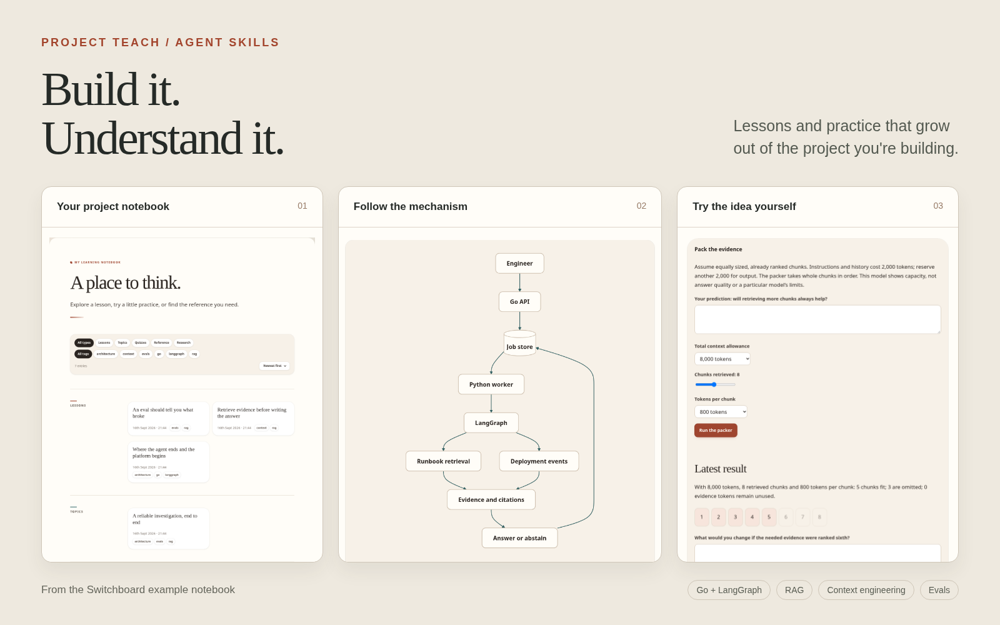

# Project Teach

Learn the ideas behind the code you're building with a coding agent that keeps a project notebook you can return to later.

Ask about a design decision, read an explanation using your code, and return to the implementation. Request a quiz when practice would help.

Lessons, practice and notes live in a browsable `.notebook/` inside your project. Subject records link lessons and completed work, giving the next session a useful starting point.

## Install and use

Run this from the project you want to learn in. It installs the teaching package from this repository's `skills/` folder:

```sh
npx skills@latest add bradypp/project-teach
```

Choose your coding agent when prompted. Install all five skills: they share references, templates and helpers. You need Node.js for the installer and Python 3 for the notebook helper. Generated pages open in a browser without a server.

Ask your agent for the skill by name, or use its skill picker. Start with the question in front of you; setup is optional.

| Skill | Example request |
| --- | --- |
| `teach` | “Call the Skill tool for `teach`. Our search finds the right runbook, but the answer ignores it. Explain how evidence gets from retrieval into the prompt, using this project's code.” |
| `teach-setup` | “Call the Skill tool for `teach-setup`. I'm building an incident agent with Go and LangGraph. Help me choose a learning goal and notebook theme.” |
| `teach-quiz` | “Call the Skill tool for `teach-quiz`. Give me a trace where a useful source disappears before generation. Let me locate the failure before showing the explanation.” |
| `teach-review` | “Call the Skill tool for `teach-review`. I'm about to add worker retries. Help me check what I understand about leases and what I should revisit first.” |
| `teach-update` | “Call the Skill tool for `teach-update`. I completed the retry task. Link the work to what I learned about stable request identity.” |

Use your agent's skill directory as the destination. This installer refuses to overwrite existing skills.

## What it teaches

The subject comes from your work, not a fixed course. A retry bug can lead to a lesson on idempotency. A slow query can become a worked example of indexing. The agent explains the useful mechanism and context; the lesson remains a reference while you continue building.

Substantial explanations become HTML lessons with code, diagrams and links to related topics. Practice can ask you to predict a result, debug a scenario or change inputs in an experiment. You can discuss your answer in chat, ask for a deeper explanation, or keep building without finishing the exercise.

The notebook keeps useful explanations close to the code. Topic pages connect related lessons; a thin learning-state summary and subject records distinguish what was taught, applied in project work and explained by the learner.

## Explore an example

The [Switchboard notebook](https://bradypp.github.io/project-teach/) follows an incident-investigation agent.

[](https://bradypp.github.io/project-teach/)

| Open an example | Try this |
| --- | --- |
| [Where the agent ends and the platform begins](https://bradypp.github.io/project-teach/lessons/agent-runtime.html) | Follow a request into a durable job. Decide what happens when a worker finishes after losing its lease. |
| [Context lab](https://bradypp.github.io/project-teach/quizzes/context-lab.html) | Retrieve more chunks without increasing the token budget. Predict which evidence still fits. |
| [Incident room](https://bradypp.github.io/project-teach/quizzes/incident-room.html) | Find where the trace lost the useful evidence, then compare your diagnosis with the feedback. |
| [An eval should tell you what broke](https://bradypp.github.io/project-teach/lessons/evals-that-find-the-failure.html) | Separate retrieval, packing and answer failures before changing the prompt. |
| [Replay is not resume](https://bradypp.github.io/project-teach/lessons/replay-is-not-resume.html) | Work out why repeating a read-only tool call can change an investigation's answer. |

## Your files, in your project

Open `.notebook/index.html` to browse lessons, topics, quizzes and references. Setup offers Parchment, Ocean, Forest, Plum and Graphite palettes, plus an optional starter `.notebook/PREFERENCES.md` you can edit later. The page dropdown shows each palette once; choosing the project default clears your browser override. The adjacent control switches between light and dark appearance. Pages also support Markdown export. The files are yours to edit and track in Git; there's no separate learning account or global progress store.

Lesson follow-up controls prepare a prompt for chat. Quizzes can copy your current responses and revealed feedback. Neither action sends a message or marks a topic as learned. Copy or save your answers before leaving the page.

The five skills live in [skills/](skills/). For shared guidance, optional integrations, publishing and contributor checks, see the [maintenance guide](docs/maintenance.md).
