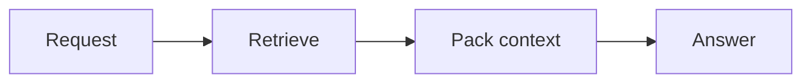
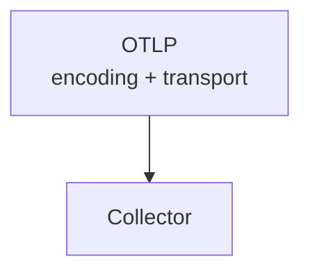
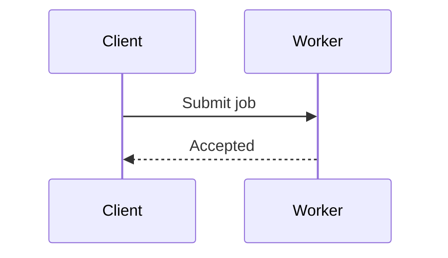
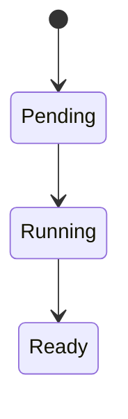
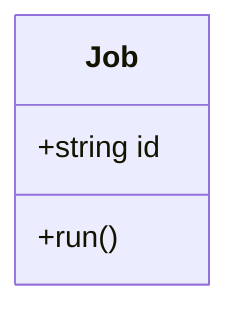
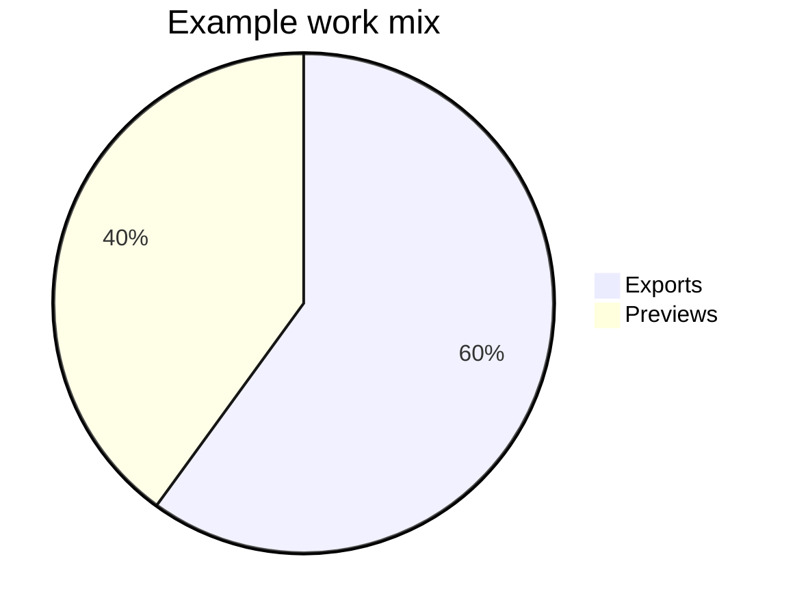
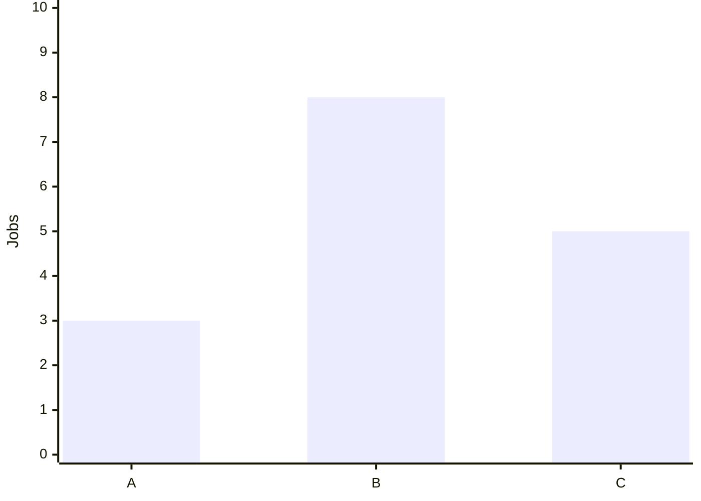
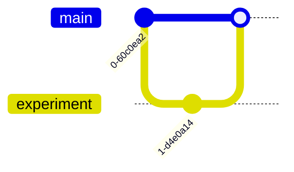

# Mermaid diagrams

Read when creating or changing a Mermaid visual. Use the bundled [diagram component](../assets/templates/diagram.html); put escaped Mermaid source inside `pre.mermaid` within `figure.diagram`, followed by a descriptive `figcaption`.

## Choose a form

Use a diagram to expose a relationship or sequence that prose alone obscures.

- Start a flow with `flowchart LR` so the sequence reads from left to right. Check the rendered width, counting branches and subgraphs as well as the longest path. More than five columns is a cue to reconsider the layout, not a hard limit.
- When the horizontal flow is wide, choose the form that best explains its purpose: keep local scrolling if the labels remain readable and the continuous flow matters; use `flowchart TD` if a vertical sequence reads more naturally; or split distinct stages into connected figures with matching names and captions. Give each figure one explanatory job.
- Keep labels to a short phrase. Use Markdown labels (`A["`Authorise the request`"]`) so the shared 180px width wraps long phrases at word boundaries. For an intentional break, place an actual line break inside the quoted Markdown label. A literal backslash-n is text and can appear inside Mermaid's generated paragraph instead of breaking it. Put qualifications, long identifiers and implementation details in nearby prose or a table.
- Shorten edge labels as carefully as node labels. Branches, cross-links and subgraphs can make a vertical diagram wide too. Preserve relationships when changing layout; never reorder a process simply to fit it.

For a deliberate two-line node label, use a physical newline in the Mermaid source:

These chart values are illustrative. Use supported syntax for the bundled version; consult [official Mermaid documentation](https://mermaid.js.org/intro/) for additional forms or syntax you have not verified.

## Shared theming and export

- [components.js](../assets/components.js) configures Mermaid from the active CSS tokens at render time and re-renders when the palette or light/dark appearance changes. Agents author the diagram, not a new palette.
- Keep colour settings and theme directives out of individual diagram definitions. Improve shared configuration when a diagram family needs additional tokens.
- The renderer uses natural size when it fits, scales to 87.5% when necessary, then offers local horizontal scrolling rather than making text smaller. Markdown flowchart labels wrap using shared configuration; ordinary plain labels should be converted to Markdown form when long. Shared subgraph-title margins keep cluster labels clear of borders and nodes.
- Captions explain the visual's meaning. Markdown export retains the Mermaid source and caption; it does not preserve an interactive renderer.
- Use ASCII for a simpler text relationship, or themed custom SVG/canvas for visuals Mermaid cannot express well.

## Check and repair

- Check rendering and readability in both appearances and affected palettes after introducing a new diagram form or changing shared rendering code. Routine diagrams need a quick visual/content check.
- If parsing fails, inspect the visible source fallback. Check diagram type, arrows, quoted labels and HTML escaping first; reduce to a small valid example before restoring complexity.
- Inspect a new diagram at its actual reading width and a narrow viewport. Labels must be readable without browser zoom, remain inside their nodes, and have no overlaps or clipped arrowheads. For a scrolling figure, check that its start is reachable, its hint appears and keyboard focus allows reading the rest without widening the page.
- If a visual is too wide to read comfortably, shorten or wrap labels and recheck the chosen layout. Keep the caption useful as a textual explanation of the complete diagram.
- If colours clash, inspect shared theme variables rather than applying white backgrounds or inline colour patches to the page.
